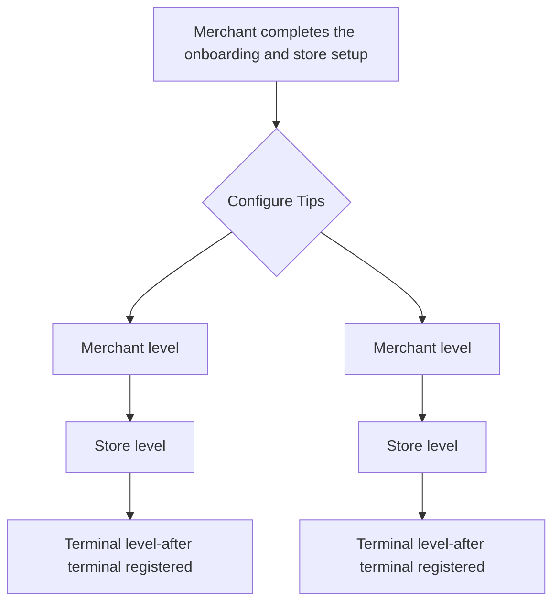

# Configure tips

Merchants can configure tips, allowing them to set both preset and custom tip amounts. Tips can be configured from the Merchant Dashboard. Additionally, partners can utilize the [**Tips APIs**](/api/tips) to set up tip configurations for merchants. When making payments, customers can select from these preset tip values or opt to input a custom amount based on their preference.

## Overview of the flow

## Pre-requisites

- API Credentials and **`partnerId`**.
- **`merchantId`** obtained by using [**Create merchant API**](/api/merchants#Create-Merchant).
- **`storeId`** of the store obtained by using [**Create store API**](/api/stores#Create-Store).

## Tips Configuration

Merchants and partners can enable and customize tips at multiple levels: **Partner**, **Merchant**, **Store**, or **Terminal**. Customers can select preset tip percentages or enter custom amounts during payment.

### Configuration Options

| **Option** | **Description** |
| --- | --- |
| **Enabled** | Allows tips to be accepted during payment processing. |
| **Disabled** | Prevents tips from being accepted during payment processing. |
| **Preset Tip Values** | Up to three percentage values (e.g., 5%, 10%, 15%) for customers to choose from. |

## Tips Settings

Tip settings can be configured via **APIs** or the **Partner Portal** at different hierarchical levels: **Terminal, Store, Merchant,** and **Partner**. Lower-level settings override higher-level ones, system ensures that the specific setting is always applied. These settings apply to all in-store terminals, including SurfTouch, SurfPad, SurfPrint, and SoftPOS.

**For Example:**

1. **Lower-level configuration overrides higher-level configurations**:
    
    If a configuration is set at the **Terminal level**, it will override any settings at the **Partner**, **Merchant**, and **Store** levels.
    
2. **Configuration fetched from higher levels**:
    
    If no configuration is set at the **Terminal**, **Store**, or **Merchant** levels, the system will automatically fetch the default setting from the **Partner level**.
    

> All the parameters can be configured individually, eliminating the need to configure all parameters at once.



## Fetch tips configurations

Partners can use the following APIs to get information regarding the tips configurations at various levels:

- [**Fetch Merchant Tips Config API**](/api/tips#Fetch-Merchant-Tips-Config): To get information about the tips configuration for all the terminals associated with a specific merchant.
- [**Fetch Store Tips Config API**](/api/tips#Fetch-Store-Tips-Config): To get information about the tips configuration for all the terminals registered to a specific store.
- [**Fetch Terminals Tips Config API**](/api/tips#Fetch-Terminal-Tips-Config): To get information about the tips configuration set at the individual terminal level.

Merchants can get information regarding their tips configurations from the Merchant Dashboard.

