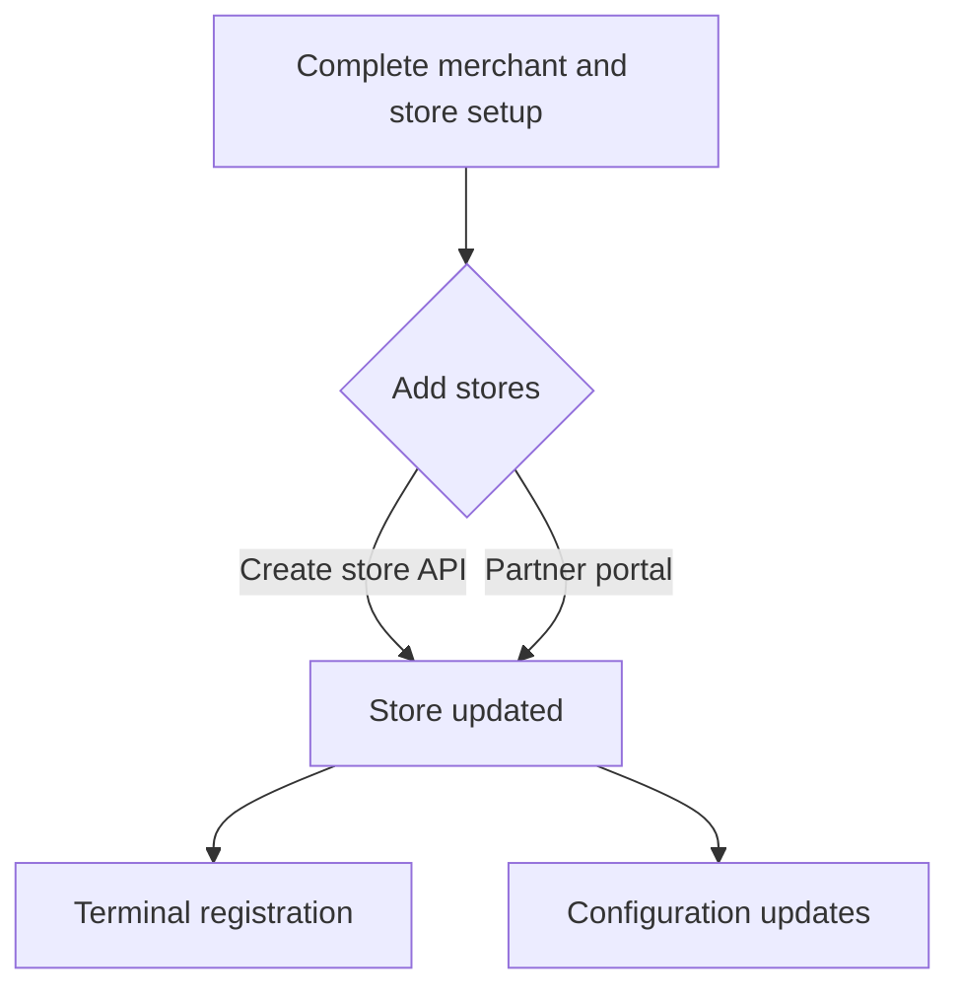

# Manage stores

A store is the physical location where sales occur. During the merchant creation process, a default store can be created. Merchants or Partners can create additional stores as needed using the [**createStore API**](/api/stores#Create-Store). Each store is identified by a unique **Store ID** linked to the merchant.

## Pre-requisites

- API Credentials.
- **`merchantId`** obtained via [**Create Merchant API**](/api/merchants#Create-Merchant).

## Overview of the flow

## Create and add stores



## Update store details



