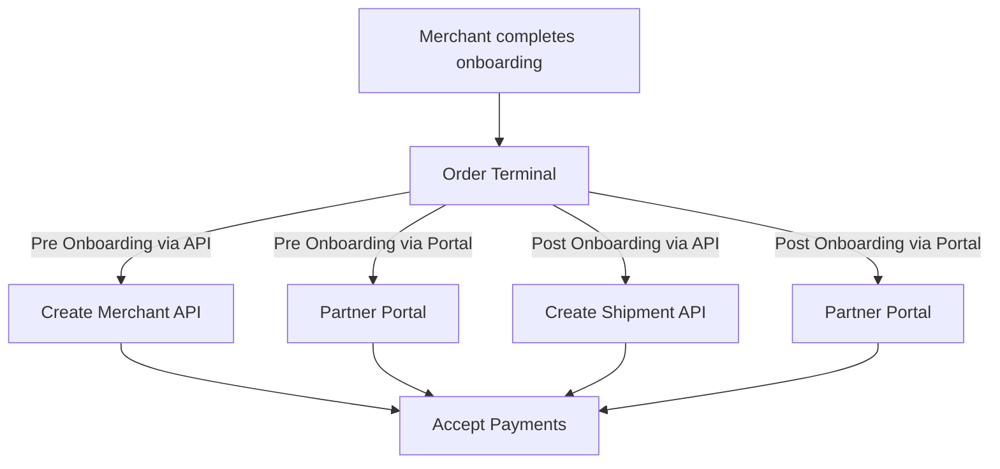

# Order terminals

This section provides an overview of ordering terminals during or after merchant onboarding, and managing shipments through Surfboard APIs and the Partner Portal.

## Overview of the flow

## To order terminals

### Pre-requisites

- **API Credentials**: Valid API-KEY, API-SECRET, and **`partnerId`** for access to APIs.
- Merchant’s **`country`**  and **`organisation`** with the  **`corporateId`**  are required for [**Create Merchant API**](https://developer-portal-dev.web.app/api/merchants?lang=cURL#Create-Merchant).

### During onboarding



## Ordering additional terminals

## After onboarding

If the merchants require additional terminals and accessories, they can order them from either the Surfboard's Merchant Dashboard or the Partner's Merchant Portal. Partners can use the [**Create Shipment API**](https://developers.surfboardpayments.com/api/logistics#Create-Shipment) to create a shipment order for terminals and other accessories for the merchants.

### Pre-requisites

- **API Credentials**: Valid API-KEY, API-SECRET, and **`partnerId`** for access to APIs.


## Tracking Shipments

Partners can track the shipment of ordered terminals using the [**Get Shipment Status API**](https://developer-portal-dev.web.app/api/logistics?lang=cURL#Get-Shipment-Status). To do so, 

1. Send a **`GET`** request to **Get shipment status API**. You will receive a response containing the following details:
    - **`orderStatus`**: The current status of the shipped terminals.
    - **`trackingUrl`**: A link to track the location of the shipped package.
    - **`deliveryPartner`**: The person or service responsible for delivering the package.
    - **`packageDetails`**: Information about the shipped terminal, including productId and serialNumber.

Here’s an example request and response to track the shipments

{% requestresponse method="GET" requests=[{language: "cURL", code: "curl -H 'Content-Type: application/json' \\\n     -H 'API-KEY: YOUR_API_KEY' \\\n     -H 'API-SECRET: YOUR_API_SECRET' \\\n     -H 'MERCHANT-ID: YOUR_MERCHANT_ID' \\\n     YOUR_API_URL/partners/:partnerId/merchants/:merchantId/shipment/:orderId"}] response="{\n\t\"status\": \"SUCCESS\",\n\t\"data\": {\n\t\t\"orderStatus\": \"ORDER_PENDING_FOR_STOCK\",\n\t\t\"trackingUrl\": \"\",\n\t\t\"deliveryPartner\": \"DHL\",\n\t\t\"packageDetails\": [\n\t\t\t{\n\t\t\t\t\"productId\": \"817361bb0a23400701\",\n\t\t\t\t\"serialNumber\": \"\"\n\t\t\t}\n\t\t]\n\t},\n\t\"message\": \"Order status fetched successfully\"\n}" languages=["cURL"] /%}

