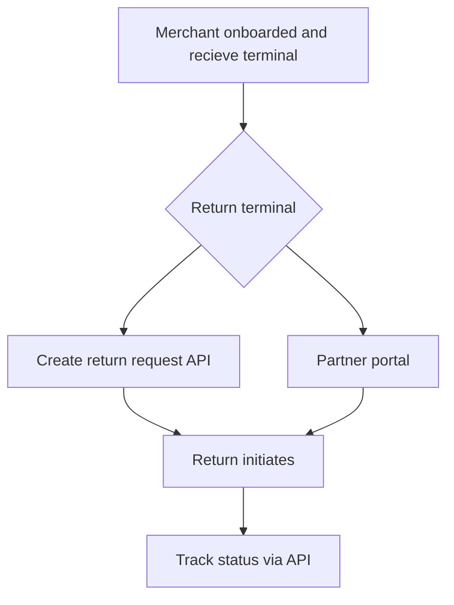

# Return malfunction/defective terminals

If case of receiving a malfunctioning or defective terminal, you can return it to Surfboard and track its status using either the **Partner Portal** or **API**.

## Overview of the flow

## Pre-requisites

- **API Credentials**: Valid API-KEY, API-SECRET, and **`partnerId`** for access to APIs.
- **`terminalId`** :Id of the terminal that should be returned.

## To return terminal

## Track the return status

Partners can track all the return request associated with them using [**Fetch All Return Requests** API](api/logistics#Fetch-All-Return-Requests) by following these steps



