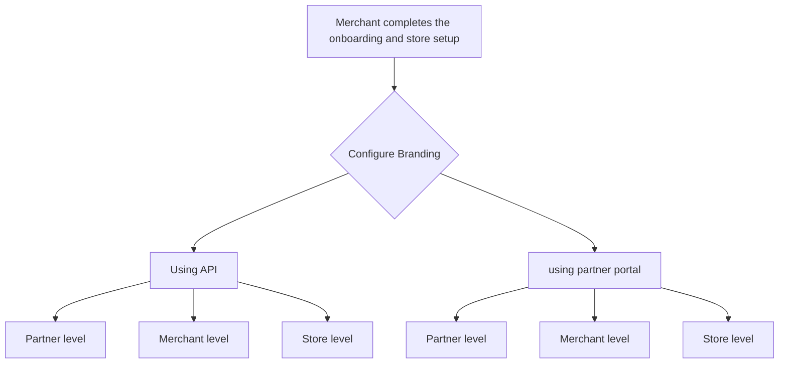

# Configure branding

Surfboard's flexible online payment solutions enable you to create a cohesive, personalized checkout experience, with options to customize colors, fonts, logos, and much more to reflect your unique brand identity.

## Online Payments Branding

We offer several customisation options for you to change the branding to reflect your identity.

You can use our branding API to customise the online checkout experience. With our branding feature you can customise the following

1. Background colour - This will be your background colour
2. Brand colour - This is the primary colour of your page
3. Accent colour - This is the secondary colour that compliments your Brand colour
4. Shape of the page buttons - The available shapes are rounded, pill and edgy
5. Font type - Currently we provide the font types: sans-serif, serif and mono
6. Logo displayed on the screen
7. Icons displayed on the page.

The following shows you the difference between before and after the branding applied on the final checkout page.

## Configuration Hierarchy

| **Level**          | **Description**                                                                                                   |
| ------------------ | ----------------------------------------------------------------------------------------------------------------- |
| **Partner Level**  | Branding applied at the partner level acts as a default for all associated merchants and stores.                  |
| **Merchant Level** | Overrides partner-level branding for specific merchants, ensuring that a merchant’s unique identity is reflected. |
| **Store Level**    | Overrides the configurations set on Partner and Merchant level to enable store-specific branding.                 |

## Activate branding

Partners can configure branding at various levels using both **Partner portal** and [branding APIs](/api/branding), which is applicable to both in-store and online payments.

## Overview of the flow

### Pre-requisites

- API Credentials and **`partnerId`**.
- **`merchantId`**: Obtained by integrating a merchant via the [**Create Merchant API**](https://developers.surfboardpayments.com/api/merchants#Create-Merchant).
- **`storeId`**: Generated when creating a store using the [**Create Store API**](https://developers.surfboardpayments.com/api/stores#Create-Store).



## Fetching Branding

You can also retrieve existing branding configurations using the [Fetch Branding APIs](/api/branding):

-   [**Fetch Branding for Merchant**](/api/branding#Fetch-Branding-for-Merchant): Retrieve the current branding setup for a specific merchant.
-   [**Fetch Branding for Store**](/api/branding#Fetch-Branding-for-Store): Retrieves the current branding configuration for a particular store.
-   [**Fetch Branding for Partner**](/api/branding#Fetch-Branding-for-Partner): Retrieves the existing branding configurations at a partner level.


