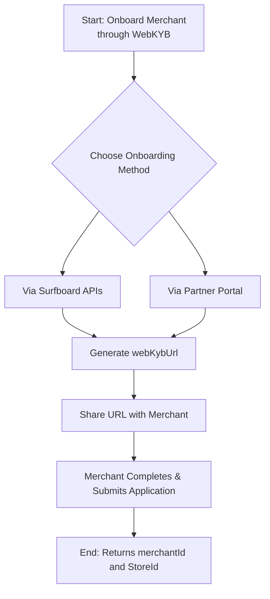

# Onboard your merchants for online payment acceptance

## Introduction

Online onboarding is similar to the in-store onboarding with the only exception of creating online store for online payment acceptance after the merchant creation. So there are basically two steps involved for the onboarding process

1. Merchant onboarding and store creation
2. Online store setup

On completion of these two, you can register terminals, configure it, and integrate payment flow to accept online payments.

## Overview of the onboarding flow

## Pre-requisites

To create a merchant application and track its status, ensure you have the following:

- **API Credentials**: Valid API-KEY, API-SECRET, and **`partnerId`** for access to APIs.
- Merchant’s **`country`**  and **`organisation`** with the  **`corporateId`**  are required for application creation.

## Merchant Creation

Partners can either initiate merchant application via partner portal or the [**Create Merchant API**](/api/merchants#Create-Merchant).



## Online Store Setup

### Domain Verification


Domain verification is only required in the production environment. When testing in the demo environment, you can skip this step and proceed directly with terminal registration.


In the production environment, when a merchant is onboarded and an online store is created or upgraded to support online payments, a store onboarding session is initiated. As part of this, you must first verify that you own your store's domains. The steps are as follows,

- **Get Verification Keys**: When a store is created or updated, you'll be given unique domain verification keys for both the paymentPageHostURL (if provided) and the merchantWebshopURL. Alternatively, you can use the [**Fetch Store Domains API**](/api/stores#Fetch-Store-Domains) to retrieve the store domain details.
- **Verify Your Domain**: Add these keys as a **TXT record** to your domain's DNS settings. Surfboard will automatically attempt verification every 6 hours, or you can manually trigger a verification attempt using the [**Verify Domain API**](/api/stores#Verify-Store-Domain).
- **Check Status**: You can monitor the overall onboarding status of your store and confirm if the domains have been successfully verified using the [**Fetch Store Details API**](/api/stores#Fetch-Store-Details).

After successful store creation or update, you will receive a Store ID, which is required for registering terminals and managing store-related operations.


Domain verification is mandatory to proceed with store onboarding, but it does not guarantee approval. Once the domain is verified, the onboarding team will review the Terms & Conditions, Privacy Policy, and other store details. If any of these are incomplete or insufficient, merchants must update them before approval.


Under a partner account, a domain only needs to be verified once. For example, if example.com is verified for the first merchant, it does not need to be verified again for any other merchants under the same partner.

### Store Review & Approval

After successful domain verification, Surfboard's onboarding team will review the store session, including compliance checks on store policies. If everything meets the requirements, the store will be approved. This process typically takes one business day.

Once approved, you can register your terminal and integrate payment flow to begin accepting online payments


