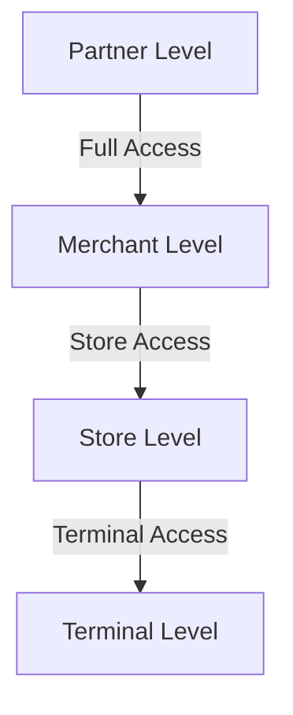

# Platform Structure

## Overview

Surfboard's platform is built on a hierarchical structure that organizes payment operations across four distinct levels: Partners, Merchants, Stores, and Terminals. Each level serves specific functions and has unique responsibilities within the payment ecosystem.

## Platform Hierarchy and general payment flow

## Understanding Each Level

### Partners
Partners are organizations that integrate Surfboard's payment solutions into their business ecosystem. They represent the highest level in our platform hierarchy.

**Who are Partners?**
- Payment Facilitators (PayFacs)
- Platform Providers (PaaS)
- Independent Software Vendors (ISVs)
- Large Enterprises managing multiple merchants

**Partner Types**

1. **ISO Partner (Independent Sales Organization)**
   - Partners without financial license
   - Surfboard handles:
     - Merchant onboarding
     - Payment processing
     - Settlement management
   - Best for: Partners focusing on sales and distribution
   - Reduced regulatory requirements
   - Faster time to market

2. **FI Partner (Financial Institution/Payment Facilitator)**
   - Partners with financial license
   - Partner handles:
     - Merchant onboarding
     - Payment processing oversight
     - Settlement management
   - Surfboard provides:
     - Platform infrastructure
     - Technical capabilities
     - Integration tools
   - Greater control over financial operations
   - Higher regulatory requirements
   - Full ownership of merchant relationships

**What Partners Do:**
- Onboard and manage multiple merchants
- Configure platform-wide payment settings
- Access consolidated reporting across merchants
- Manage merchant groups and hierarchies
- Set platform-level branding and configurations

**Partner Capabilities:**
- API credential management
- Multi-merchant reporting
- Platform-wide configurations
- Merchant onboarding automation
- Advanced security controls

### Merchants
Merchants are the businesses that accept payments through Surfboard's platform. They can operate independently or be part of a partner's ecosystem.

**Merchant Types:**

1. **Standard Merchants**
   - Fully managed by Surfboard
   - Surfboard handles:
     - Merchant onboarding
     - Payment processing
     - Settlement management
   - Complete end-to-end payment solution

2. **Payment Facilitator (PF) Merchants**
   - Surfboard provides:
     - Terminal infrastructure
     - Payment processing capabilities
   - Partner handles merchant relationships
   - Integrated with partner's existing systems

**Who are Merchants?**
- Retail businesses
- E-commerce companies
- Service providers
- Food & beverage establishments
- Any business accepting payments

**What Merchants Do:**
- Manage their payment operations
- Configure payment methods
- Handle transactions and settlements
- Manage store locations
- Monitor business performance

**Merchant Features:**
- Payment method configuration
- Store management
- Settlement handling
- Transaction reporting
- Branding customization

### Stores
Stores represent physical or virtual locations where transactions occur. They are the operational units under merchants.

**Types of Stores:**
- Physical retail locations
- E-commerce websites
- Mobile points of sale
- Service locations
- Virtual terminals

**Store Functions:**
- Process transactions
- Manage terminals
- Handle day-to-day operations
- Track location-specific performance
- Manage staff access

**Store Capabilities:**
- Terminal management
- Staff access control
- Location-specific reporting
- Operational configurations
- Receipt customization

### Terminals
Terminals are the endpoints where payments are actually processed. They can be physical devices or virtual interfaces.

**Terminal Types:**

1. **Physical Terminals:**
   - SurfTouch: Advanced touchscreen terminals
   - SurfPad: Tablet-based solutions
   - SurfPrint: Receipt printer terminals
   - Other certified hardware terminals

2. **Online Terminals:**
   - Payment Page: Hosted payment solution
   - Self-hosted SDK: Embedded payment fields
   - MIT (Merchant Initiated Transactions): Recurring payment handling

**Terminal Features:**
- Payment processing
- Receipt generation
- Customer interface
- Security compliance
- Payment method support

## Hierarchical Relationships

### Access Control

### Configuration Flow
- **Top-down Settings:**
  - Partner configurations affect all lower levels
  - Merchant settings apply to all their stores
  - Store settings apply to their terminals

- **Override Capabilities:**
  - Lower levels can override certain inherited settings
  - Specific configurations can be locked at higher levels


