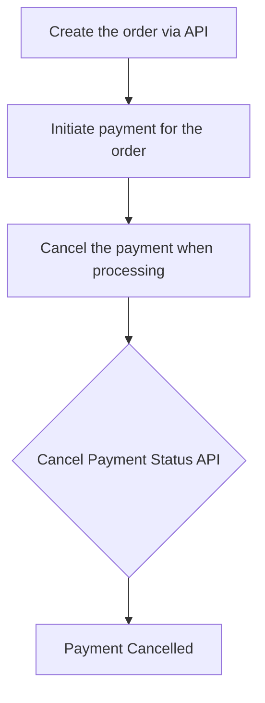

# Cancel a payments

You can cancel a payment for an order if necessary, but only before the payment transfer is completed. Once the payment has been completed, you cannot cancel it directly, instead you will need to void the payment.

## Overview of the flow

## Pre-requisites

**`paymentId`** from the [**Initiate a Payment API**](/api/payments#Initiate-a-Payment) .

## To cancel payments

1. Make a request to the **Cancel a Payment API** endpoint using the **`paymentId`** obtained from the **Initiate a Payment API** call.
2. The response will contain a **`paymentStatus`** field, which indicates the status of the payment whether it can be cancelled or not, the possible values are,
    - **PAYMENT_COMPLETED:** Payment is completed and cannot be cancelled.
    - **PAYMENT_FAILED:** Failed payments cannot be cancelled.
    - **PAYMENT_CANCELLED:** The payment has been canceled successfully.

Here's an example




