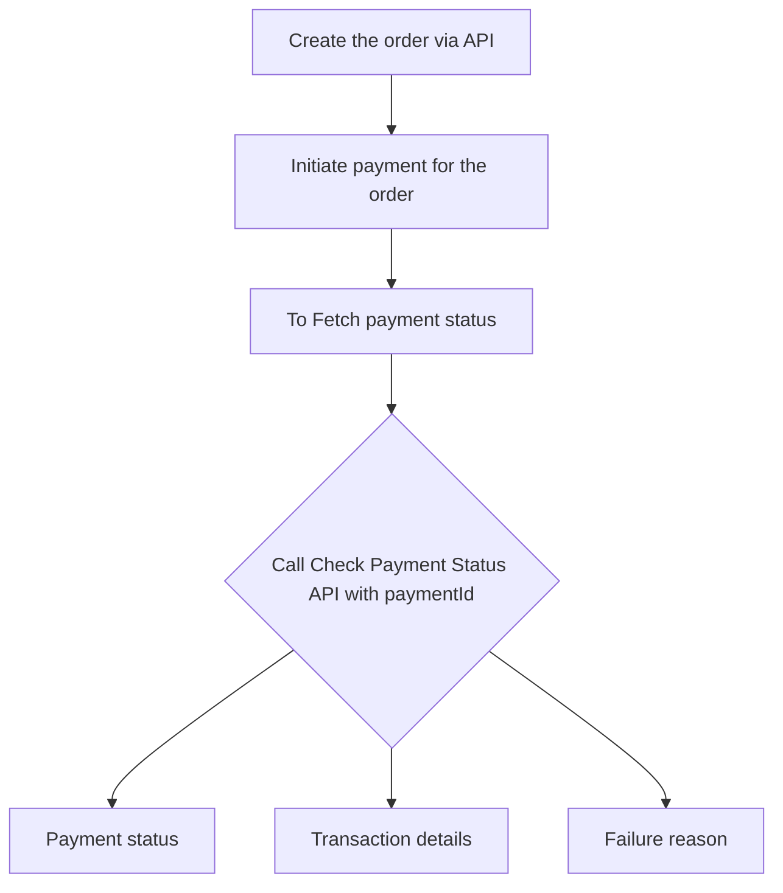

# Check payment status

Payment status is crucial for merchants to track payments being processed, completed, or canceled. Partners can retrieve the status of a payment for their merchants using the [**Check Payment Status API**](/api/payments#Check-Payment-Status).

## Overview of the flow

## Pre-requisites

-   **`paymentId`** returned from the [**Initiate a Payment API**](/api/payments#Initiate-a-Payment) .

## To check payment status

1. Include the **`paymentId`** of the transaction in your request to the [**Check Payment Status API**](/api/payments#Check-Payment-Status).
2. The response will include a **`paymentstatus`** field indicating the current state of the payment, as follows:
    - **PAYMENT_INITIATED:** The payment has been initiated.(waiting for user action to complete the payment process)
    - **PAYMENT_PROCESSING:** The payment is being authorized.
    - **PAYMENT_PROCESSED:** The payment has been successfully authorized.
    - **PAYMENT_COMPLETED:** The payment is successfully completed and **`transactionId`** is returned in the response.
    - **PAYMENT_FAILED:** The payment is failed and **`failureReason`** is returned in the response.
    - **PAYMENT_CANCELLED:** The payment has been canceled due to the user’s action to stop the transaction before completion. Payments can also be cancelled directly through the terminal.


You can also know the status of order by integrating [**webhooks**](/guides/in-store-payments/integrations/webhooks) which allows you to to get real-time updates on payment events directly, eliminating the need for frequent system requests to the Surfboard systems and providing immediate order status notifications.


Here's an example




On successful completion of a payment, an associated transaction record is created. The transaction details can be fetched using the [**Transaction APIs**](/api/transactions).



