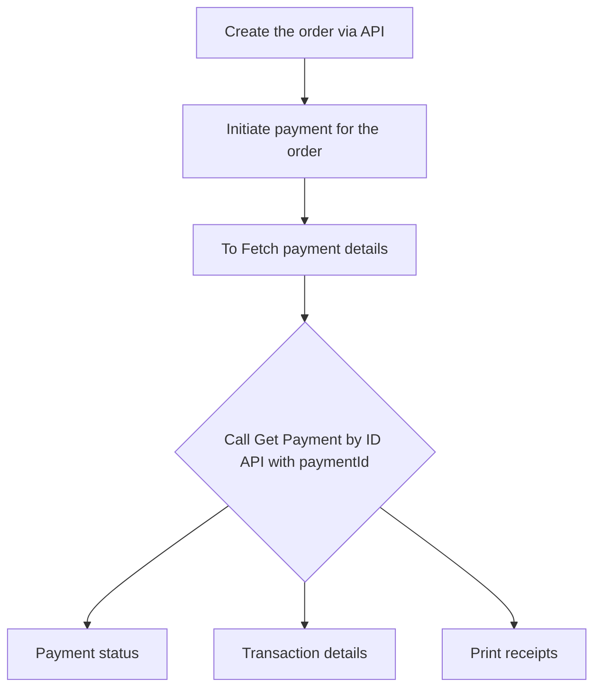

# Fetch payment information by ID

Fetching Payment Information by ID involves retrieving specific transaction details using a unique identifier. This process helps you to resolve issues, and verify payment records. By accessing this payment information, you can generate and display a receipt for the specific payment, allowing you to print the receipt directly from the API response without additional processing.

## Overview of the flow

## Pre-requisites

-   **`paymentId`** from the [**Initiate a Payment API**](/api/payments#Initiate-a-Payment) .

## To fetch payment information

1. To get detailed payment information, include **`paymentId`** in the [Get Payment by ID API](/api/payments#Get-Payment-by-ID) request.
2. The response will provide a **`paymentStatus`** indicating the status, along with other detailed payment information as described below in the table. Then status of the payment including possibilities such as
    - **PAYMENT_COMPLETED:** The payment is completed.
    - **PAYMENT_FAILED:** The payment is failed.
    - **PAYMENT_CANCELLED:** The payment is cancelled.

Here's an example

{% requestresponse method="GET" requests=[{language: "cURL", code: "\ncurl -H 'Content-Type: application/json' \\\n     -H 'API-KEY: YOUR_API_KEY' \\\n     -H 'API-SECRET: YOUR_API_SECRET' \\\n     -H 'MERCHANT-ID: YOUR_MERCHANT_ID' \\\n     YOUR_API_URL/payments/:paymentId"}] response="{\n\t\"status\": \"SUCCESS\",\n\t\"data\": {\n\t\t\"orderId\": \"8137664f855eb0050b\",\n\t\t\"terminalId\": \"8116617f8dabb00704\",\n\t\t\"merchantId\": \"81412e2e4102f80f0e\",\n\t\t\"paymentId\": \"8129930915ba500006\",\n\t\t\"storeId\": \"813bf6be8510c0070f\",\n\t\t\"transactionId\": \"813766720466781e19\",\n\t\t\"amount\": \"3000\",\n\t\t\"currency\": \"SEK\",\n\t\t\"type\": \"PURCHASE\",\n\t\t\"paymentStatus\": \"PAYMENT_COMPLETED\",\n\t\t\"method\": \"CARD\",\n\t\t\"cardLabel\": \"VISA\",\n\t\t\"userMessage\": \"Payment completed and capture completed successfully\",\n\t\t\"truncatedPan\": \"0102\",\n\t\t\"posEntryMode\": \"07\",\n\t\t\"terminalVerificationResult\": \"0400008001\",\n\t\t\"aid\": \"a0000000041010\",\n\t\t\"customerResponseCode\": \"00\",\n\t\t\"cvmMethod\": \"12345\",\n\t\t\"timestamp\": \"2023-04-18T09:44:09.520Z\",\n\t\t\"rrn\": \"123456789\",\n\t\t\"authMode\": \"ISSUER\",\n\t\t\"voided\": false\n\t},\n\t\"message\": \"Payment details fetched successfully\"\n}" languages=["cURL"]/%}

You can get the following information as a response about a payment:

| **Attribute**                | **Description**                                                                                                                                                                                                                                                                                                 |
| ---------------------------- | --------------------------------------------------------------------------------------------------------------------------------------------------------------------------------------------------------------------------------------------------------------------------------------------------------------- |
| Payment status               | Status of the payment.                                                                                                                                                                                                                                                                                          |
| Transaction ID               | Available for completed or failed payments.                                                                                                                                                                                                                                                                     |
| Merchant ID                  | Merchant ID of the merchant who performed the payment.                                                                                                                                                                                                                                                          |
| Terminal ID                  | Terminal ID of the checkout or payment terminal from which the payment was made.                                                                                                                                                                                                                                |
| Order ID                     | Order ID of the order for where the payment was made.                                                                                                                                                                                                                                                           |
| Payment ID                   | Unique ID of the payment                                                                                                                                                                                                                                                                                        |
| Store ID                     | Store ID of the store where the payment was made.                                                                                                                                                                                                                                                               |
| Currency                     | Currency in which the payment is made                                                                                                                                                                                                                                                                           |
| Amount                       | Amount involved in the payment in the minor unit of the currency (e.g., 10 SEK is 1000 in amount).                                                                                                                                                                                                              |
| Method                       | The method in which the payment was carried out.                                                                                                                                                                                                                                                                |
| Type                         | Type of the payment (purchase or return).                                                                                                                                                                                                                                                                       |
| Timestamp                    | Timestamp of the payment in ISO 8601 format represented as 'YYYY-MM-DDTHH:mm:ss.sssZ'.                                                                                                                                                                                                                          |
| Truncated PAN                | The last four digits of the PAN (Primary Account Number) from the card used for the payment.                                                                                                                                                                                                                    |
| Card label                   | The designated label of the card brand for the payment, often referred to as the AID (Application Identifier) Label.                                                                                                                                                                                            |
| POS entry mode               | Two digit code that indicates the mode of entry for the card during the transaction, which is based on EMV specifications. This determines whether the card was used in a contact or contactless manner. The possible values are 01 (Manual entry), 02(Magnetic stripe), 07 (Chip with PIN).                    |
| Terminal verification result | Specifies the additional results if the payment underwent EMV terminal verification.                                                                                                                                                                                                                            |
| User message                 | A message string from the terminal related to the particular payment                                                                                                                                                                                                                                            |
| AID                          | The Application Identifier (AID) associated with the card used for the payment.                                                                                                                                                                                                                                 |
| Customer response code       | Two character response used in payment systems to show the result or status of a transaction as experienced by the customer. For all approved transaction, this code is '00' and for declined transactions, the code is '05'.                                                                                   |
| CVM method                   | Indicates the Card Holder Verification Method (CVM) used in the transaction. The first character in the CVM Method determines the CVM type. '1' - Offline plaintext PIN, '2'- Online PIN, '3' - Offline plaintext PIN/Signature, '4' - Offline PIN, '5' - Offline PIN/Signature, 'E' - Signature, 'F' - No CVM. |
| RRN                          | Indicates the Retrieval Reference Number(RRN) of the transaction. RRN is a key to uniquely identify a card transaction based on the ISO 8583 standard.                                                                                                                                                          |
| Authentication mode          | Specifies the authentication mode of the payment. This can be either 'ISSUER' or 'CARD'.                                                                                                                                                                                                                        |
| ARC                          | Authorization code (ARC), a code that confirms that the transaction was approved by the card issuer. Only present when the text/html header is passed in.                                                                                                                                                       |
| TSI                          | Transaction Status Information (TSI), a code that provides additional information about the transaction status. Only present when the text/html header is passed in.                                                                                                                                            |
| Voided                       | Denotes payment has been voided or not.                                                                                                                                                                                                                                                                         |


