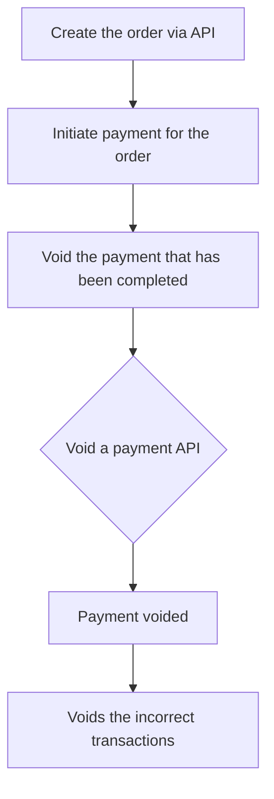

# Void a payment

Voiding a payment will stop the payment process before any money is moved from the customer’s account to the merchant’s account. This helps avoid issues with incorrect transactions soon after the payment is initiated. Merchants can do this by using the **Void a payment API**.


Voiding a payment is possible only before 23:00 UTC and cannot be done when the payment is not completed.


## Overview of the flow

## Pre-requisites

-   **`paymentId`** obtained from the [**Initiate a Payment API**](/api/payments#Initiate-a-Payment) for the transaction you want to void.

# To void a payment

1. To void a payment, you need to include the **`paymentId`** of the transaction into your request to the [**Void a payment API**](/api/payments#Void-a-Payment), then you can effectively cancel the payment.
2. The response will contain a **`voidStatus`** which is required to fetch the void status such as,
    - **VOID_INITIATED:** Void is initiated. (on process of cancelling request of a payment)
    - **CANNOT_VOID:** cannot be voided.(either transaction is not completed or exceeds the void period i.e., 23.00 UTC)
    - **VOIDED:** Void is completed. (completed payments are cancelled)

Here's an example



## Void vs Return/Refund

Voiding a payment is the cancelling of the transaction before any money transfer takes place, hence should happen within a specific time interval( before 23:00 UTC). Void does not require the cardholder to be present.

Returns, however, are issued after a transaction has settled and the merchant has received payment. This can be done for any number of days after the actual purchase.

There are two modes available under refunds,

-   Card Present Refunds
-   Card Not Present Refunds (Online)

In the Card Present refunds case, the customer is required to tap the card on the terminal. This is the standard flow in the API currently.

In the Card Not Present Refund flow, the money will automatically be returned to the card used in the purchase.


